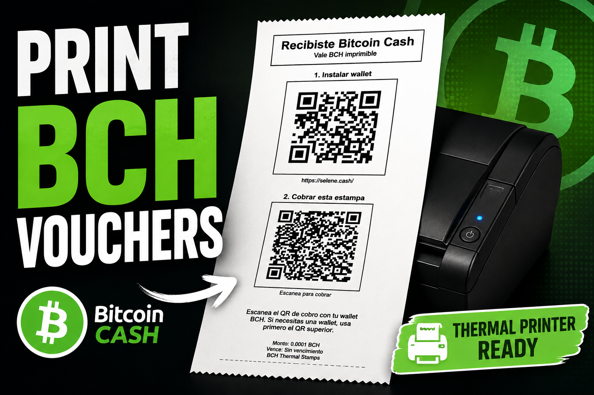
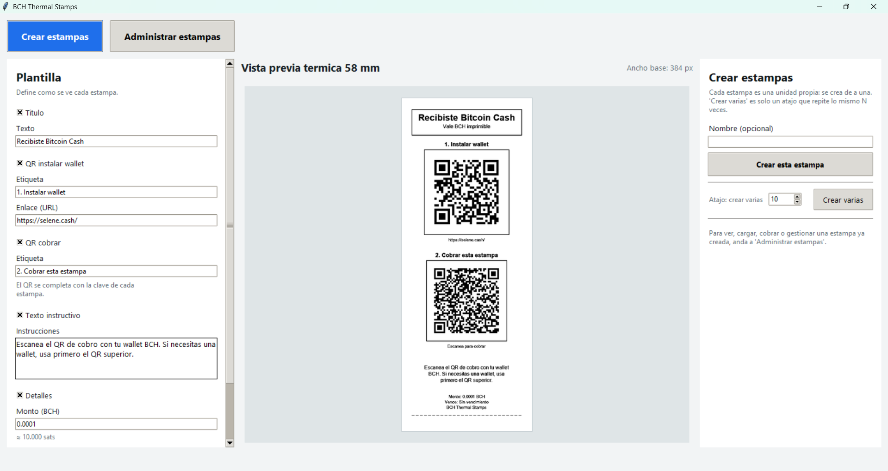
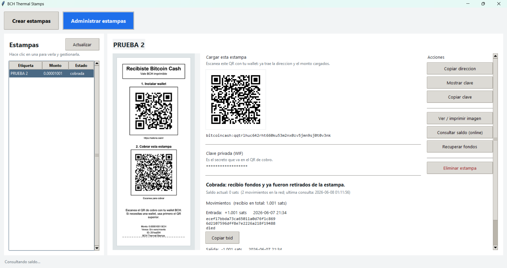

<p align="center">
  
</p>

# BCH Thermal Stamps

Aplicacion de escritorio (Windows) para crear estampas imprimibles de Bitcoin
Cash y gestionarlas una por una. Cada estampa es un vale real: lleva su propia
clave BCH y un QR de cobro que cualquiera puede escanear para barrer los fondos.

## Capturas de pantalla

### Crear estampas



### Administrar estampas



## Idea

- La unidad es **una estampa**. Crear "varias" es solo repetir la creacion N veces.
- Cada estampa se gestiona individualmente: direccion de fondeo, clave privada,
  saldo on-chain y recuperacion de fondos no reclamados.
- La generacion de claves e imagenes es **offline**; solo consultar saldo y
  recuperar fondos usan internet.

## Como funciona una estampa

1. Al crearla se genera una clave BCH nueva (direccion + WIF).
2. El **QR de cobro contiene el WIF** -> quien lo escanea con su wallet barre los
   fondos (igual que un paper wallet). Es trustless: nadie custodia la plata.
3. Vos cargas la estampa enviando BCH a su **direccion de fondeo**.
4. Si nadie la reclama, podes **recuperar los fondos** barriendolos a tu wallet
   (la app guarda la clave, asi que siempre podes recuperar).

> El secreto vive en el QR impreso y en la base local. Cualquiera que tenga el
> papel puede cobrarlo, como si fuera efectivo. Guarda los impresos con cuidado.

## Como ejecutarla (con Python)

Desde esta carpeta:

```powershell
pip install -r requirements.txt
python run.py
```

O doble clic en `start_bch_thermal_stamps.bat`.

## Como generar un .exe para compartir (sin instalar nada en la otra PC)

```powershell
pip install pyinstaller
build_exe.bat
```

El ejecutable queda en `dist\BCH-Thermal-Stamps.exe`. Copialo a donde quieras: no
necesita Python ni dependencias. Guarda su carpeta `data\` (al lado del .exe) si
queres conservar las estampas y sus claves.

## Pantallas

- **Izquierda (Plantilla):** define como se ve cada estampa (titulo, QR de
  instalar wallet, QR de cobro, instrucciones, monto, etc.) y guarda disenios.
- **Centro:** vista previa termica + boton para crear 1 o varias estampas + lista
  de todas las estampas.
- **Derecha (Estampa seleccionada):** direccion de fondeo, clave privada, ver/
  imprimir imagen, consultar saldo, recuperar fondos y eliminar.

## Datos

Todo se guarda localmente en `data/` (base SQLite + imagenes PNG). No se sube nada
a internet salvo las consultas de saldo y el envio de transacciones de recuperacion.

## Nota tecnica

- BCH real con la libreria `bitcash` (claves, WIF, CashAddr, saldo, barrido).
- QR con la libreria `qrcode` (el de cobro usa correccion de errores alta para
  sobrevivir a la impresion termica).
- Render de imagen con Pillow, en blanco y negro puro a 384 px de ancho (58 mm).
